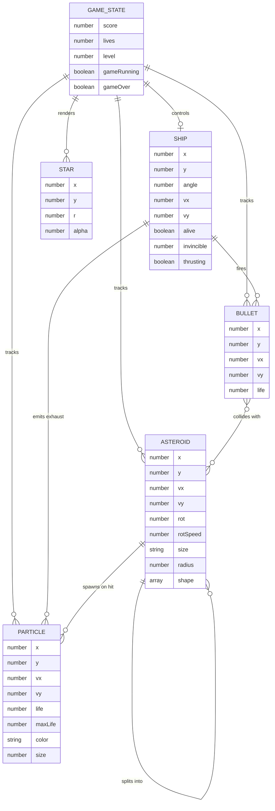
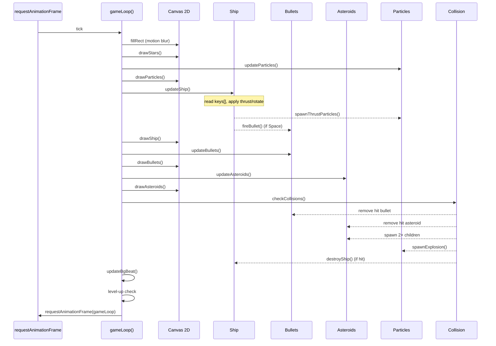
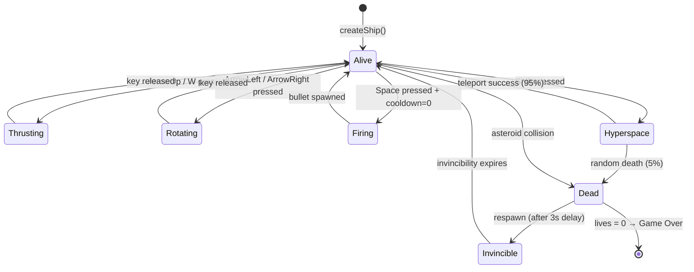
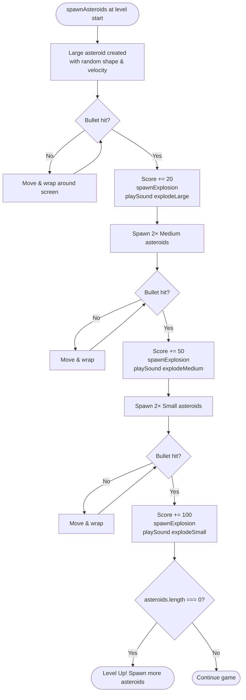
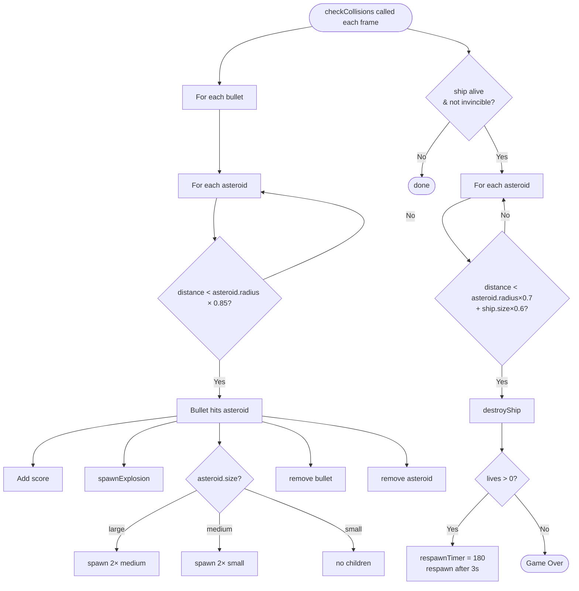
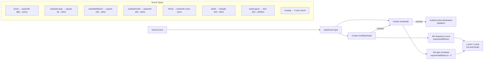
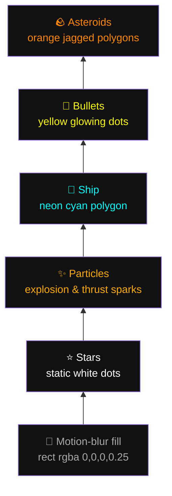
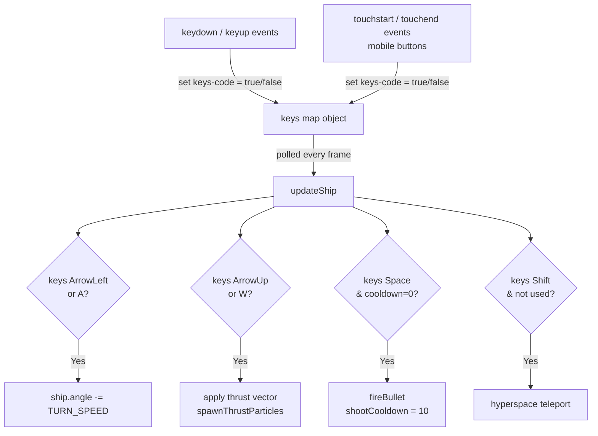

# Asteroids Game — Design & Architecture

The game is built as a **single-file HTML5 application** using the Canvas 2D API. It follows a classic **game loop architecture** with clear separation of concerns across modules.

---

## Diagrams

### 1. Entity Relationship Diagram



---

### 2. Game Loop Sequence Diagram



---

### 3. Ship State Machine



---

### 4. Asteroid Lifecycle



---

### 5. Collision Detection Flow



---

### 6. Audio Synthesis Flow



---

### 7. Rendering Layer Stack



---

### 8. Input Handling Architecture



---

## High-Level Structure

```
index.html
├── <style>        — UI layout & overlay styling (CSS)
├── <canvas>       — rendering surface
├── <div#ui>       — HUD (score, level, lives) — fixed overlay, pointer-events: none
├── <div#overlay>  — title/game-over screen
└── <script>       — all game logic (~500 lines of JS)
    ├── Canvas setup & resize
    ├── Audio engine (Web Audio API)
    ├── Constants
    ├── State variables
    ├── Ship module
    ├── Bullet module
    ├── Asteroid module
    ├── Particle system
    ├── Star field
    ├── Collision detection
    ├── Background beat
    ├── Game loop
    ├── Game control (start / end)
    └── Input handling (keyboard + touch)
```

---

## Core Pattern: Entity–Update–Draw

Every game object follows the same **3-step lifecycle** each frame:

```
update*(entity)  →  mutates position/velocity/state
draw*(entity)    →  renders to canvas
```

| Module    | Update fn           | Draw fn           |
|-----------|---------------------|-------------------|
| Ship      | `updateShip()`      | `drawShip(s)`     |
| Bullets   | `updateBullets()`   | `drawBullets()`   |
| Asteroids | `updateAsteroids()` | `drawAsteroids()` |
| Particles | `updateParticles()` | `drawParticles()` |

---

## Game Loop (`gameLoop`)

```
requestAnimationFrame(gameLoop)
  │
  ├── Clear canvas (motion blur via semi-transparent fill)
  ├── drawStars()
  ├── updateParticles() → drawParticles()
  ├── updateShip()      → drawShip()
  ├── updateBullets()   → drawBullets()
  ├── updateAsteroids() → drawAsteroids()
  ├── checkCollisions()
  ├── updateBgBeat()
  └── Level-up check (asteroids.length === 0)
```

The **motion blur** effect is achieved by filling the canvas each frame with a semi-transparent black (`rgba(0,0,0,0.25)`) instead of fully clearing it — previous frames fade out naturally.

---

## State Management

All mutable game state lives in **module-level variables**:

```js
let ship, bullets, asteroids, particles;  // entity arrays
let score, lives, level;                  // game stats
let keys = {};                            // keyboard state map
let shootCooldown, respawnTimer;          // timers
```

The `keys` object is a simple **boolean map** (`{ ArrowUp: true, Space: false, ... }`) updated by `keydown`/`keyup` listeners. Input is *polled* inside `updateShip()` each frame rather than being event-driven — this is the standard game-loop input pattern.

---

## Asteroid Splitting Logic

```
bullet hits asteroid
        │
        ├── size === 'large'  → spawn 2× 'medium'
        ├── size === 'medium' → spawn 2× 'small'
        └── size === 'small'  → no children (destroyed)
```

Each asteroid's shape is a **procedurally generated polygon** — a fixed number of vertices placed at random radii around a circle, giving every asteroid a unique jagged look.

---

## Particle System

A **single shared `particles[]` array** handles both explosion debris and engine exhaust. Each particle is a plain object:

```js
{ x, y, vx, vy, life, maxLife, color, size }
```

Alpha is computed as `life / maxLife` — particles fade out linearly. This avoids any class overhead and keeps the system simple.

---

## Audio (Web Audio API)

No audio files are used. Every sound is **synthesized in real-time**:

- Oscillator type (`sine` / `sawtooth` / `square`) sets the timbre
- `frequency.exponentialRampToValueAtTime` creates pitch sweeps
- `gain.exponentialRampToValueAtTime` creates natural fade-outs
- Each call creates and immediately disposes its own oscillator node (fire-and-forget pattern)

The **background heartbeat** uses the same approach — two alternating low-frequency tones whose interval shrinks as fewer asteroids remain, creating tension.

---

## Wrapping / Screen Edges

All entities use a single `wrap(v, max)` helper:

```js
function wrap(v, max) {
  if (v < 0)   return v + max;
  if (v > max) return v - max;
  return v;
}
```

Applied to both `x` and `y` each frame — entities seamlessly cross screen edges.

---

## Rendering Layers (painter's algorithm, back-to-front)

```
1. Motion-blur fill (semi-transparent black)
2. Stars (static background)
3. Particles (behind everything)
4. Ship
5. Bullets
6. Asteroids
```

Neon glow is achieved with Canvas `shadowBlur` + `shadowColor` — no WebGL required.